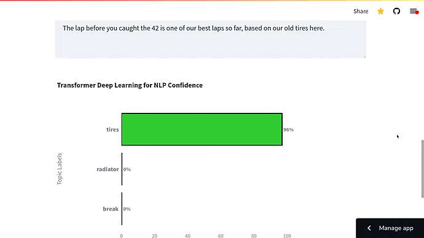

# NASCAR Radio Communication Classification

This repository contains the code for a Streamlit application that allows users to test our natural language processing (NLP) models for classifying radio communications in a car racing context. 

This project was conducted as a capstone project under the supervision of [Yeow Teck Keat](https://www.linkedin.com/in/yeow-tk/) from [Rolos](https://rolos.com/) during our Bootcamp at [Constructor](https://learning.constructor.org/). The team, comprised of [Adriano Persegani Daguzan](https://www.linkedin.com/in/adriano-persegani/), [Tuyen Nguyen Thi](https://www.linkedin.com/in/tuyen-nguyen-thi-7576967b/), [Yeeun Kim](https://www.linkedin.com/in/yeeun-kim-bba19b15b/), and [Ibrahima Ba](https://www.linkedin.com/in/ibrahima-ba-data-scientist-germany/), collaborated to help NASCAR, a car racing company, classify the information being transmitted during a race for faster and more accurate responses. 

## Problem Statement

During a car race, a lot of information is communicated between drivers and engineers. Among this information, some might not be crucial while others, like messages related to tire fuel or emergency situations, should never be missed. The challenge is to accurately and quickly deliver only the important information to the pilot team. 

Our solution to this problem was to use NLP techniques to automatically and accurately classify the radio communications. We worked with data already transformed from voice radio communication into text. 

## Our Approach

1. **Unsupervised Machine Learning:** We used unsupervised machine learning models to identify the topics based on word distribution. This approach allowed us to group similar topics together.

2. **Supervised Machine Learning:** To enhance the accuracy of the classification, we employed supervised machine learning models. We trained the models on 600 messages with 29 topics with the aim to accurately classify the topic of new, unseen messages. 

## Models Used

We experimented with different types of models including:

- **Rule-Based Model:** This is a simple, classical machine learning model. It, however, did not perform as well as the other models, possibly due to its simple algorithm and its performance on smaller datasets. 

- **Transformer Models:** These models use more advanced technology that can analyze the context of a message. They performed much better than the rule-based model. 

- **Few-shot Learning Models:** These models performed the best, even with very few training data. They were able to predict with more than 50% accuracy on some topics like fuel or tires.

## Future Work

Although our model is already up and running, we believe that with more computational power, more time, and more data, we could improve its accuracy. We could consider more context or even whole conversations for future improvements.

## Try It Out

Our project allows you to test two distinct models we developed for NASCAR's radio communication classification task: a Logistic Regression model and a DistilBERT model. These models have been fine-tuned for this specific task and were developed using Python's popular libraries such as NLTK, Spacy, Scikit-learn, and TensorFlow.

### Model 1: Logistic Regression

The first model we implemented is a Logistic Regression model. Here is a step-by-step breakdown of how we built and fine-tuned this model:

1. **Text Normalization:** Before feeding the text data into the model, we preprocessed and normalized it to reduce noise and focus on meaningful parts. We used the NLTK library to remove English stopwords and lemmatize the words. Lemmatization is a process of reducing inflected (or sometimes derived) words to their base or root form.

2. **Vectorization:** After preprocessing the data, we used the CountVectorizer from Scikit-learn to convert the normalized text data into a numerical representation (also known as a document-term matrix). We set the `min_df` to 6 and `max_df` to 0.6 to exclude terms that are too frequent or rare in the corpus.

3. **Model Training:** We then trained a multinomial Logistic Regression model on this document-term matrix. This model was chosen because it performs well on multiclass classification problems and is easily interpretable.

4. **Prediction and Result Generation:** After training, we used the model to predict the probabilities for each label in the training data. We then converted these probabilities into a dataframe with the corresponding labels and merged it with the original data.

### Model 2: DistilBERT

The second model we implemented is based on DistilBERT, a lighter and faster version of BERT, which is a transformer model known for its superior performance in NLP tasks.

1. **Text Normalization:** Similar to the first model, we preprocessed the text data. However, the process is less aggressive as DistilBERT can leverage the context of sentences better with more information retained.

2. **Tokenization and Input Preparation:** We used the DistilBertTokenizer to convert our text data into tokens. We limited the maximum sequence length to 85 to keep the input size manageable. We then converted these tokens into their corresponding IDs and prepared the attention masks, both of which are necessary inputs for DistilBERT.

3. **Model Architecture:** We built a model architecture with the TFDistilBertModel as the backbone. We extracted the pooled output of the last hidden state, which is a fixed-size representation of the input sequence. This output was then passed through two dense layers for further learning.

4. **Model Training:** We compiled the model with Adam optimizer and sparse categorical cross-entropy as the loss function (due to multiclass nature of our problem). We then fitted the model on our tokenized input data and corresponding labels. We used a callback for early stopping to prevent overfitting.

Both models have their strengths and limitations. The Logistic Regression model is simpler, more interpretable, and requires less computational power. However, it might not capture the contextual information as effectively as DistilBERT, which is a more complex model but has proven to be highly effective in various NLP tasks.

You can test our models yourself on our web app at [radionascar.com](http://www.radionascar.com). We have uploaded both models for you to try out. Note that the underlying code for training these models won't be provided directly through the web app, but the description above gives you a comprehensive overview of the steps involved in their creation.

Your feedback would be much appreciated.

## Connect With Us

Feel free to connect with us on LinkedIn. 

- [Adriano Persegani Daguzan](https://www.linkedin.com/in/adriano-persegani/)
- [Tuyen Nguyen Thi](https://www.linkedin.com/in/tuyen-nguyen-thi-7576967b/)
- [Yeeun Kim](https://www.linkedin.com/in/yeeun-kim-bba19b15b/)
- [Ibrahima Ba](https://www.linkedin.com/in/ibrahima-ba-data-scientist-germany/)

Thank you very much for your time.
